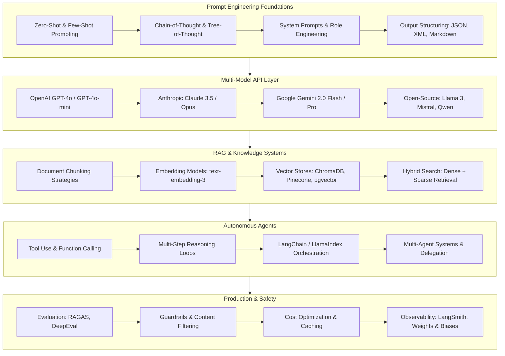
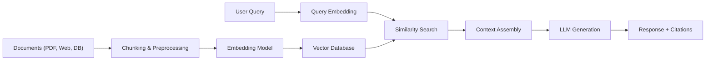

# Awesome LLM Agents, RAG & Prompt Engineering Handbook 2026 🧠

> Production-ready patterns for building autonomous AI agents, Retrieval-Augmented Generation pipelines, multi-model orchestration, and advanced prompt engineering across ChatGPT, Claude, Gemini, and open-source LLMs.

[](LICENSE)
[](https://platform.openai.com/)
[](https://www.anthropic.com/)
[](https://ai.google.dev/)
[](https://python.langchain.com/)
[](https://www.lucebra.com)
[](CONTRIBUTING.md)

---

## 📑 Table of Contents
1. [LLM Engineering Roadmap](#1-llm-engineering-roadmap)
2. [Prompt Engineering Patterns](#2-prompt-engineering-patterns)
3. [Multi-Model API Integration](#3-multi-model-api-integration)
4. [RAG Pipeline Architecture](#4-rag-pipeline-architecture)
5. [Autonomous Agent Patterns](#5-autonomous-agent-patterns)
6. [LLM Evaluation & Benchmarking](#6-llm-evaluation--benchmarking)
7. [Production Guardrails & Safety](#7-production-guardrails--safety)
8. [Project Blueprints](#8-project-blueprints)
9. [Curated Learning Resources](#9-curated-learning-resources)
10. [Contributing](#10-contributing)

---

## 1. LLM Engineering Roadmap



---

## 2. Prompt Engineering Patterns

### Chain-of-Thought with Structured Output
```python
SYSTEM_PROMPT = """You are an expert course curriculum designer.
Think step by step before producing your final answer.

Follow this reasoning process:
1. Analyze the topic scope and prerequisites
2. Identify 4-6 logical learning modules
3. For each module, define 3-5 lessons with clear objectives
4. Ensure progressive difficulty and practical exercises

Return your response as valid JSON matching this schema:
{
  "topic": "string",
  "total_hours": number,
  "modules": [
    {
      "title": "string",
      "lessons": ["string"],
      "project": "string"
    }
  ]
}"""
```

### Few-Shot Classification Pattern
```python
def build_intent_classifier_prompt(user_message: str) -> str:
    return f"""Classify the user's intent into exactly one category.

Examples:
User: "How do I reset my password?"
Intent: ACCOUNT_SUPPORT

User: "Can I get a refund for this course?"
Intent: BILLING

User: "What Python courses do you recommend for beginners?"
Intent: COURSE_DISCOVERY

User: "My video won't play on mobile"
Intent: TECHNICAL_ISSUE

User: "I want to become an instructor on your platform"
Intent: INSTRUCTOR_ONBOARDING

Now classify:
User: "{user_message}"
Intent:"""
```

### Prompt Comparison Matrix

| Technique | Best For | Token Cost | Accuracy |
| :--- | :--- | :--- | :--- |
| **Zero-Shot** | Simple classification, extraction | Low | Medium |
| **Few-Shot** | Pattern-heavy tasks, formatting | Medium | High |
| **Chain-of-Thought** | Math, logic, multi-step reasoning | High | Very High |
| **Tree-of-Thought** | Complex planning, creative writing | Very High | Highest |
| **ReAct** | Tool-augmented reasoning | Variable | High |

---

## 3. Multi-Model API Integration

### Unified Multi-Provider Client
```python
from openai import OpenAI
from anthropic import Anthropic
import google.generativeai as genai
import os

class MultiModelClient:
    """Unified interface for OpenAI, Anthropic, and Google Gemini."""

    def __init__(self):
        self.openai = OpenAI(api_key=os.getenv("OPENAI_API_KEY"))
        self.anthropic = Anthropic(api_key=os.getenv("ANTHROPIC_API_KEY"))
        genai.configure(api_key=os.getenv("GOOGLE_API_KEY"))

    def complete(self, prompt: str, provider: str = "openai", **kwargs) -> str:
        match provider:
            case "openai":
                return self._openai_complete(prompt, **kwargs)
            case "anthropic":
                return self._anthropic_complete(prompt, **kwargs)
            case "gemini":
                return self._gemini_complete(prompt, **kwargs)
            case _:
                raise ValueError(f"Unknown provider: {provider}")

    def _openai_complete(self, prompt: str, model: str = "gpt-4o-mini", **kw) -> str:
        response = self.openai.chat.completions.create(
            model=model,
            messages=[{"role": "user", "content": prompt}],
            temperature=kw.get("temperature", 0.3),
            max_tokens=kw.get("max_tokens", 1000)
        )
        return response.choices[0].message.content

    def _anthropic_complete(self, prompt: str, model: str = "claude-sonnet-4-20250514", **kw) -> str:
        response = self.anthropic.messages.create(
            model=model,
            max_tokens=kw.get("max_tokens", 1000),
            messages=[{"role": "user", "content": prompt}]
        )
        return response.content[0].text

    def _gemini_complete(self, prompt: str, model: str = "gemini-2.0-flash", **kw) -> str:
        model_instance = genai.GenerativeModel(model)
        response = model_instance.generate_content(prompt)
        return response.text
```

### Cost-Per-Token Comparison (2026)

| Model | Input (per 1M tokens) | Output (per 1M tokens) | Context Window |
| :--- | :--- | :--- | :--- |
| GPT-4o | $2.50 | $10.00 | 128K |
| GPT-4o-mini | $0.15 | $0.60 | 128K |
| Claude 3.5 Sonnet | $3.00 | $15.00 | 200K |
| Claude 3.5 Haiku | $0.25 | $1.25 | 200K |
| Gemini 2.0 Flash | $0.075 | $0.30 | 1M |
| Llama 3.1 70B (self-hosted) | ~$0.50 | ~$0.70 | 128K |

---

## 4. RAG Pipeline Architecture

### Production RAG with Hybrid Search
```python
import chromadb
from openai import OpenAI

client = OpenAI()
chroma = chromadb.PersistentClient(path="./rag_store")

def chunk_document(text: str, chunk_size: int = 512, overlap: int = 64) -> list[str]:
    """Sliding window chunking with overlap for context preservation."""
    words = text.split()
    chunks = []
    for i in range(0, len(words), chunk_size - overlap):
        chunk = ' '.join(words[i:i + chunk_size])
        if chunk.strip():
            chunks.append(chunk)
    return chunks

def embed_and_store(doc_id: str, text: str, collection_name: str = "docs"):
    collection = chroma.get_or_create_collection(
        name=collection_name,
        metadata={"hnsw:space": "cosine"}
    )
    chunks = chunk_document(text)
    for i, chunk in enumerate(chunks):
        embedding = client.embeddings.create(
            model="text-embedding-3-small", input=chunk
        ).data[0].embedding
        collection.add(
            ids=[f"{doc_id}_chunk_{i}"],
            embeddings=[embedding],
            documents=[chunk],
            metadatas=[{"doc_id": doc_id, "chunk_index": i}]
        )

def rag_query(question: str, top_k: int = 5) -> dict:
    collection = chroma.get_collection("docs")
    q_embed = client.embeddings.create(
        model="text-embedding-3-small", input=question
    ).data[0].embedding

    results = collection.query(query_embeddings=[q_embed], n_results=top_k)
    context = "\n\n---\n\n".join(results["documents"][0])

    response = client.chat.completions.create(
        model="gpt-4o-mini",
        messages=[
            {"role": "system", "content": (
                "Answer the question using ONLY the provided context. "
                "If the context doesn't contain the answer, say so. "
                "Cite the relevant passage numbers."
            )},
            {"role": "user", "content": f"Context:\n{context}\n\nQuestion: {question}"}
        ],
        temperature=0.1
    )
    return {
        "answer": response.choices[0].message.content,
        "sources": results["metadatas"][0],
        "relevance_scores": results["distances"][0] if results.get("distances") else []
    }
```

### RAG Architecture Diagram


---

## 5. Autonomous Agent Patterns

### ReAct Agent with Tool Use
```python
import json
from openai import OpenAI

client = OpenAI()

TOOLS = [
    {
        "type": "function",
        "function": {
            "name": "search_courses",
            "description": "Search the course catalog by topic, skill, or keyword",
            "parameters": {
                "type": "object",
                "properties": {
                    "query": {"type": "string", "description": "Search query"},
                    "max_results": {"type": "integer", "default": 5}
                },
                "required": ["query"]
            }
        }
    },
    {
        "type": "function",
        "function": {
            "name": "get_course_details",
            "description": "Get detailed information about a specific course",
            "parameters": {
                "type": "object",
                "properties": {
                    "course_id": {"type": "string"}
                },
                "required": ["course_id"]
            }
        }
    }
]

def run_agent(user_message: str, max_iterations: int = 5) -> str:
    messages = [
        {"role": "system", "content": "You are a helpful course advisor. Use tools to find relevant courses."},
        {"role": "user", "content": user_message}
    ]

    for _ in range(max_iterations):
        response = client.chat.completions.create(
            model="gpt-4o-mini",
            messages=messages,
            tools=TOOLS,
            tool_choice="auto"
        )
        msg = response.choices[0].message

        if not msg.tool_calls:
            return msg.content

        messages.append(msg)
        for tool_call in msg.tool_calls:
            result = execute_tool(tool_call.function.name, json.loads(tool_call.function.arguments))
            messages.append({
                "role": "tool",
                "tool_call_id": tool_call.id,
                "content": json.dumps(result)
            })

    return "I was unable to complete the request within the allowed steps."

def execute_tool(name: str, args: dict) -> dict:
    # Implementation would connect to actual course API
    return {"status": "success", "data": f"Mock result for {name}({args})"}
```

---

## 6. LLM Evaluation & Benchmarking

### Evaluation Framework
```python
from dataclasses import dataclass

@dataclass
class EvalResult:
    query: str
    expected: str
    actual: str
    relevance: float  # 0-1
    faithfulness: float  # 0-1 (no hallucination)
    latency_ms: float
    token_cost: float

def evaluate_rag_pipeline(test_cases: list[dict], rag_fn) -> dict:
    results = []
    for case in test_cases:
        import time
        start = time.perf_counter()
        response = rag_fn(case["question"])
        latency = (time.perf_counter() - start) * 1000

        results.append(EvalResult(
            query=case["question"],
            expected=case["expected_answer"],
            actual=response["answer"],
            relevance=score_relevance(case["expected_answer"], response["answer"]),
            faithfulness=score_faithfulness(response["answer"], response.get("sources", [])),
            latency_ms=latency,
            token_cost=0.0
        ))

    return {
        "avg_relevance": sum(r.relevance for r in results) / len(results),
        "avg_faithfulness": sum(r.faithfulness for r in results) / len(results),
        "avg_latency_ms": sum(r.latency_ms for r in results) / len(results),
        "p95_latency_ms": sorted(r.latency_ms for r in results)[int(len(results) * 0.95)],
        "total_cases": len(results),
    }
```

---

## 7. Production Guardrails & Safety

### Content Safety Filter
```python
SAFETY_RULES = """
Before responding, verify:
1. Response contains NO personally identifiable information (PII)
2. Response does NOT generate harmful, illegal, or unethical content
3. Response does NOT fabricate citations or statistics
4. If uncertain, explicitly state "I'm not sure about this"
5. For medical, legal, or financial questions, include a disclaimer
"""

def apply_guardrails(response: str) -> dict:
    """Post-generation safety check."""
    checks = {
        "contains_pii": any(pattern in response.lower()
            for pattern in ["ssn", "social security", "credit card"]),
        "excessive_length": len(response) > 5000,
        "empty_response": len(response.strip()) < 10,
    }
    return {
        "safe": not any(checks.values()),
        "flags": {k: v for k, v in checks.items() if v},
        "response": response if not any(checks.values()) else "[FILTERED]"
    }
```

---

## 8. Project Blueprints

| Level | Project | Stack | Deliverable |
| :--- | :--- | :--- | :--- |
| **Beginner** | CLI Chatbot with Memory | OpenAI API, Python | Conversational bot with context window management |
| **Intermediate** | Document Q&A System | LangChain, ChromaDB, Streamlit | Upload PDFs and ask questions with citations |
| **Advanced** | Multi-Agent Research Assistant | OpenAI Function Calling, FastAPI | Agents that search, analyze, and synthesize reports |
| **Expert** | Enterprise RAG with Evaluation | LlamaIndex, pgvector, RAGAS, MLflow | Production pipeline with automated quality monitoring |

---

## 9. Curated Learning Resources

### Open-Source References
- [LangChain Documentation](https://python.langchain.com/) — Build LLM-powered applications.
- [LlamaIndex Documentation](https://docs.llamaindex.ai/) — Data framework for LLM applications.
- [OpenAI Cookbook](https://cookbook.openai.com/) — Official recipes and best practices.
- [Anthropic Prompt Engineering Guide](https://docs.anthropic.com/en/docs/build-with-claude/prompt-engineering) — Claude-specific patterns.

### Accredited Courses with Verifiable Certificates
- 🧠 **GPT-4 & Python Integration:** [Zero to Hero with GPT-3 & Python](https://www.lucebra.com/courses/zero-to-hero-with-gpt3-python-building-cuttingedge-ai) — Build production AI pipelines with OpenAI SDK.
- 🤖 **LLM Comparison:** [AI Chatbots: ChatGPT vs Claude](https://www.lucebra.com/courses/ai-chatbots-compare-top-ai-tools-chatgpt-vs-claude-vs) — Practical evaluation of commercial LLMs.
- 💼 **AI Business Strategy:** [Using ChatGPT for Online Business](https://www.lucebra.com/courses/using-chatgpt-for-online-business-success) — Apply LLMs to real business workflows.

---

## 10. Contributing

We welcome contributions from AI engineers, researchers, and practitioners:
1. Fork this repository.
2. Create a feature branch (`git checkout -b feature/add-agent-pattern`).
3. Include working code examples with clear docstrings.
4. Submit a Pull Request with benchmarks where applicable.

---
*Distributed under CC0-1.0 by Lucebra Global Education ([www.lucebra.com](https://www.lucebra.com))*
